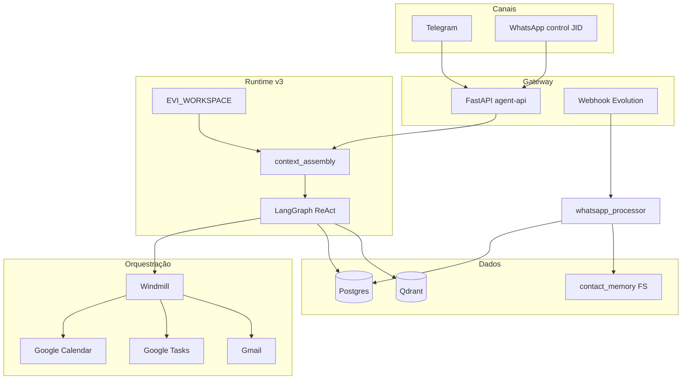

# EVI — Evolving Virtual Intelligence

Assistente pessoal local-first: LangGraph + FastAPI, integrações Google via **Windmill**, WhatsApp (Evolution API) e Telegram. Orquestração **LLM-first** com workspace, memória em camadas e fila de compromissos.

**Hardware alvo:** Intel i5-7400 · 16 GB RAM · GTX 1060 3 GB · Pop!_OS/Ubuntu  
**Custo operacional:** $0/mês (Gemini/Ollama + stack self-hosted)

| Documento | Uso |
|-----------|-----|
| [`Progress.md`](Progress.md) | Status de features e etapas de desenvolvimento |
| [`openspec/specs/`](openspec/specs/) | Requisitos (source of truth) |
| [`openspec/BACKLOG.md`](openspec/BACKLOG.md) | Fila OpenSpec / changes arquivados |
| [`docs/testing.md`](docs/testing.md) | Comandos de teste (`evi-test`) |
| [`windmill/README.md`](windmill/README.md) | OAuth, scripts, `wmill sync` |

---

## Arquitetura (Jun 2026 — v3)



### Camadas

| Camada | Componente | Papel |
|--------|------------|-------|
| Gateway | [`agent/main.py`](agent/main.py) | `/chat`, webhooks Telegram/Evolution, jobs |
| Runtime | LangGraph + [`context_assembly`](agent/services/context_assembly.py) | LLM-first; bootstrap + skills + tool snapshots |
| Workspace | [`EVI_WORKSPACE/`](EVI_WORKSPACE/) | USER.md, AGENTS.md, MEMORY.md, skills |
| Orquestração | **Windmill** ([`windmill/f/`](windmill/f/)) | Gmail, Calendar, Tasks — hub de integrações |
| Memória quente | Postgres | Sessões, `pending_commitments`, `session_tool_snapshots` |
| Memória fria | [`EVI_CONTACT_MEMORY_DIR`](agent/services/contact_filesystem.py) | profile.md, timeline.jsonl por JID |
| Vetorial | Qdrant | RAG materiais universitários |
| Grafo (opcional) | Neo4j (`--profile graph`) | Compromissos e contatos |
| LLM | Gemini (prod) / Ollama (fallback) | `EVI_LLM_PROVIDER`, `EVI_EMBED_PROVIDER` |
| Mensageria WA | Evolution API | Ingest → fila; control JIDs → grafo |

**WhatsApp:** mensagens de grupo/contatos → filtro → extração → `pending_commitments` (não passa pelo grafo de chat). **Canal de controle** (`EVI_WHATSAPP_CONTROL_JIDS`) → `/chat` como Telegram.

**Handlers diretos:** desligados por padrão (`EVI_DIRECT_HANDLERS=false`); inbox, calendário e compromissos passam pelo LLM + tools.

---

## Stack Docker

| Serviço | Porta (host) | Função |
|---------|--------------|--------|
| agent-api | 8002 | Agente FastAPI |
| windmill-server | 8001 | UI + webhooks Windmill |
| postgres | 5432 | EVI + Windmill DB |
| qdrant | 6333 | Embeddings RAG |
| evolution-api | 8082 | WhatsApp |
| neo4j | 7474/7687 | Grafo (profile `graph`) |

Ollama roda **no host** (não no compose) — `OLLAMA_BASE_URL=http://host.docker.internal:11434`.

---

## Início rápido

```bash
cp .env.example .env          # editar tokens OAuth, Telegram, Gemini
docker compose up -d --build
./scripts/evi-test smoke        # 14/14 offline
./scripts/evi-test smoke --full # inclui /chat se API up
```

Windmill (primeira vez):

```bash
./scripts/install-wmill.sh
cd windmill && ../scripts/wmill-sync.sh
```

Verificação live: [`docs/testing.md`](docs/testing.md) · `./scripts/evi-telegram-verify.sh` · `./scripts/evi-inbox-ux-verify.sh`

---

## Features implementadas

### Agente e runtime v3
- LangGraph ReAct com registry unificado ([`agent/tools/registry.py`](agent/tools/registry.py))
- Context assembly (workspace, skills, snapshots de tools, memória diária)
- Memory flush antes de truncar sessão; heartbeat dry-run
- Providers modulares: LLM/embed ([`agent/llm.py`](agent/llm.py)), Windmill ([`agent/integrations/`](agent/integrations/))

### Produtividade (Windmill → tools)
| Tool | Status |
|------|--------|
| `schedule_event` | Google Calendar |
| `list_calendar_events` | Lista eventos (`on_date`, dias de calendário) |
| `create_task` / `list_tasks` | Google Tasks |
| `summarize_inbox` | Gmail resumo |
| `delete_emails` / `delete_emails_by_query` | Gmail apagar |
| `organize_inbox` | Classificador de arquivos |
| `save_note_manual` | Notas Markdown |

### WhatsApp
- Webhook Evolution com filtro (timestamp, dedupe, whitelist de grupos)
- Extração heurística + LLM opcional (`EVI_WHATSAPP_LLM_EXTRACT`)
- Fila `pending_commitments` + digest Telegram
- Chat de controle com prefixo `[EVI]`
- Memória por contato (filesystem)

### Telegram
- Webhook ou polling (`TELEGRAM_MODE`)
- LLM-first (sem bypass de email/review quando `EVI_DIRECT_HANDLERS=false`)
- E2E: sendMessage + reply + digest

### Compromissos
- `list_pending_commitments`, `confirm_commitments`, `dismiss_commitments`
- Review multicanal; confirmar/dispensar tudo
- `list_scheduled_today`

### Memória longa (Etapa 5)
- Contact filesystem + daily summary (cron Windmill / job API)
- Neo4j opcional (`query_conversation_graph`)

### RAG
- Ingest PDF/pasta universidade → Qdrant
- `./scripts/evi-test rag --live-qdrant`

### Ops
- `GET /health`, `GET /metrics` (Prometheus)
- CI GitHub Actions (pytest + smoke)
- Retenção JSONL de logs

---

## Features planejadas

Ver [`openspec/specs/roadmap.md`](openspec/specs/roadmap.md). Resumo:

| Item | Tipo | Notas |
|------|------|-------|
| `list_calendars` tool | Feature | Script Windmill existe; falta registry |
| Auth `/chat` + `/run-task` | Segurança | `EVI_API_KEY` opcional |
| Compose profile Ollama | Infra | Stack 100% containerizada |
| MCP servers isolados | Arquitetura | Após estabilizar mais tools |
| Llava + Whisper | Multimodal | Visão e áudio remotos |
| Cache Redis embeddings | Performance | Opcional |
| Adapter WhatsApp Meta/Twilio | Integração | Via `BaseMessagingClient` |
| Heartbeat cron produção | Runtime v3 | `EVI_HEARTBEAT_ENABLED` |

---

## Estrutura do repositório

```
agent/           # FastAPI, LangGraph, tools, services
EVI_WORKSPACE/   # Bootstrap runtime (USER, AGENTS, skills)
windmill/f/      # Scripts Windmill (sync com wmill)
tests/           # Unit + fixtures + golden
scripts/         # evi-test, setup, verify
openspec/        # Specs, BACKLOG, changes archive
docs/            # testing, evolution
docker-compose.yml
```

---

## Desenvolvimento

Workflow **OpenSpec**: um change por feature → `openspec new change` → implementar → `./scripts/evi-test` → archive.

```bash
openspec list
openspec validate --specs
PYTHONPATH=agent python3 -m pytest tests/unit -q
./scripts/evi-test smoke
```

Índice de progresso: [`Progress.md`](Progress.md)  
Agentes Cursor: [`openspec/AGENTS.md`](openspec/AGENTS.md)

---

## Licença e créditos

Projeto pessoal (Marcos). Stack inspirada em padrões OpenClaw (workspace, skills, context assembly) adaptados ao EVI.
